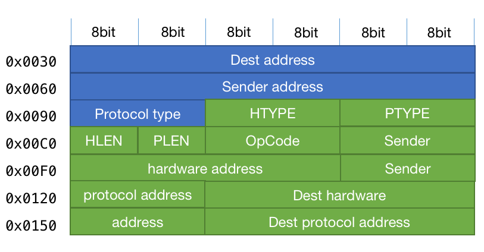

ARP 是一种通信协议，用于发现**网络层（internet layer）**地址（比如 IPv4 地址）关联的**链路层（link layer）**地址（比如 MAC 地址），有时也称为硬件地址。最早定义在 [RFC826](https://datatracker.ietf.org/doc/html/rfc826)。ARP 作用也正如其名，就是两种协议层的地址映射。

## 数据包格式 Packet Format

数据包的大小和硬件地址、网络地址大小有关。

**基于 MAC 和 IPv4 的数据包格式**



* **Dest Address**：目的主机链路层地址，通常是 MAC 地址；
* **Sender Address**：发送方链路层地址，通常是 MAC 地址；
* **Protocol type**：协议类型，比如 ARP 的值为 0x0806；
* **HTYPE**：硬件类型（Hardware type），指定链路层协议类型，局域网（Ethernet）是 1；
* **PTYPE**：协议类型（Protocol type），指定网络层协议类型，IPv4 是 0x0800；
* **HLEN**：链路层地址长度，比如 MAC 地址长度 6 个八位字节（octet）；
* **PLEN**：网络层地址长度，比如 IPv4 地址长度 4 个八位字节；
* **OpCode**：请求（request）是 1，应答（reply）是 2；
* **Sender hardware address（SHA）**：发送方链路层地址；
* **Sender protocol address（SPA）**：发送方网络层地址；
* **Dest hardware address（DHA）**：目标链路层地址；
* **Dest protocol address（DPA）**：目标网络层地址；

前面 14 个八位字节是链路层头部，后面 28 个八位字节是包数据，共 42 个八位字节。

## 工具

### arp 命令

> 下面的 MAC 地址并非真实测出的，经过了改动。

```
# 当前局域网内的所有设备 IP 和 MAC 映射列表
$ arp -a
? (192.168.10.1) at 80:26:9f:0:42:90 on en0 ifscope [ethernet]
? (192.168.10.101) at ac:a8:02:90:7:7e on en0 ifscope [ethernet]
? (192.168.10.102) at 37:13:21:34:32:83 on en0 ifscope [ethernet]
```

### Wireshark

使用 Wireshark 可以捕获 ARP 请求，比如下面：

```txt
0000   ff ff ff ff ff ff 80 26 97 00 42 90 08 06 00 01   .......v..B.....
0010   08 00 06 04 00 01 80 26 97 00 42 90 c0 a8 0a 01   .......v..B.....
0020   00 00 00 00 00 00 c0 a8 0a 64 00 00 00 00 00 00   .........d......
0030   00 00 00 00 00 00 00 00 00 00 00 00               ............
```

* 目标 MAC 地址是`ff ff ff ff ff ff`，表示广播（broadcast），所有接收方都需要应答
* 发送方 MAC 地址是`80 26 97 00 42 90`
* 协议类型是`08 06`，表示 ARP 协议
* HTYPE 是`00 01`，表示链路层是局域网（Ethernet）
* PTYPE 是`08 00`，表示网络层是 IPv4
* HLEN 是`06`，表示链路层地址长度 6 个八位字节，也即 MAC 地址长度
* PLEN 是`04`，表示网络层地址长度 4 个八位字节，也即 IPv4 地址长度
* OpCode 是`00 01`，表示请求（request）
* 发送方硬件地址是`80 26 97 00 42 90`，和链路层协议头部里面的发送方硬件地址相同
* 发送方网络地址是`c0 a8 0a 01`，即`192.168.10.01`
* 接收方硬件地址是`00 00 00 00 00 00`，表示广播
* 接收方网络地址是`c0 a8 0a 64`，即`192.168.10.100`
* 然后还有 18 个八位字节的 padding，都是 0，当然不是每个请求都有 padding。

如此，一个请求数据包的总字节数：(6+6+2)+(2+2+1+1+2+6+4+6+4)=42+18=60。

关于 padding 问题可以谷歌搜索关键词“arp packet padding”，之所以有 padding 是因为局域网类型对帧（Frame）大小的要求，比如局域网（Ethernet）要求每个帧（Frame）至少 60 字节，来源：[https://community.st.com/s/question/0D53W00000q6eoUSAQ/why-is-lwip-arp-request-message-60-bytes-long-instead-of-42-bytes](https://community.st.com/s/question/0D53W00000q6eoUSAQ/why-is-lwip-arp-request-message-60-bytes-long-instead-of-42-bytes)。

> This is because 60 bytes is the minimal legal length of ethernet packet.
> IIRC the padding is added automatically by the hardware and this can be disabled by some register bit.
>
> -- by Pavel A.

> Well you're sort of correct. According to some Google searches, the minimum frame length is 64 octets, including the FCS. Wireshark shows me ARP requests from my PC are 42 octets long. ARP requests from my STM32 controller using LWIP are 60 octets long. The Ethernet header and FCS are not passed to the protocol stack. So adding those octets to the displayed message length adds 18 octets. But the bottom line is still that the number of pad bytes being added to my ARP request messages by LWIP is excessive. The third party device, a data acq unit, doesn't respond to the long frames from my device. But does respond to my PC's ARP messages.
>
> -- by GJohn

## 相关资源

* [Address Resolution Protocol](https://en.wikipedia.org/wiki/Address_Resolution_Protocol)
* [RFC826](https://datatracker.ietf.org/doc/html/rfc826)
* [arp command](https://man7.org/linux/man-pages/man8/arp.8.html)