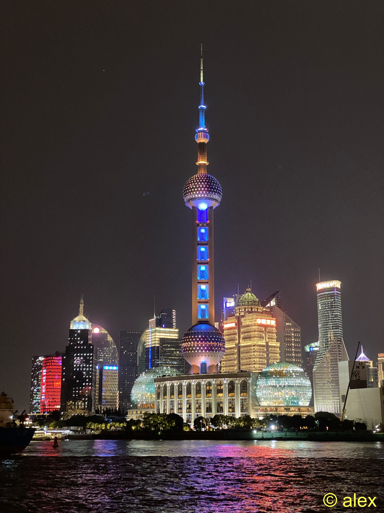
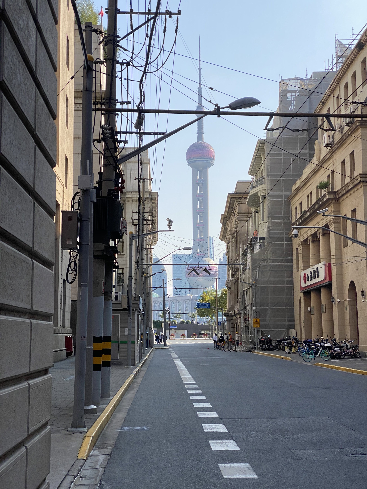
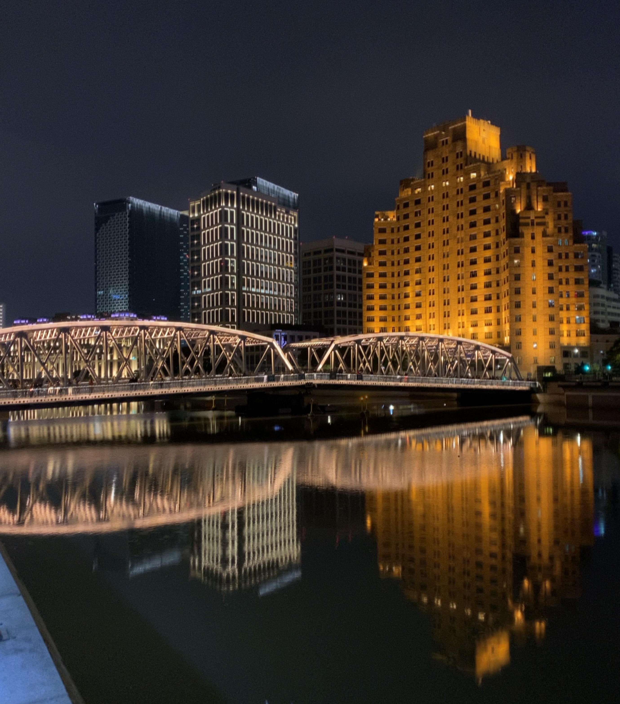
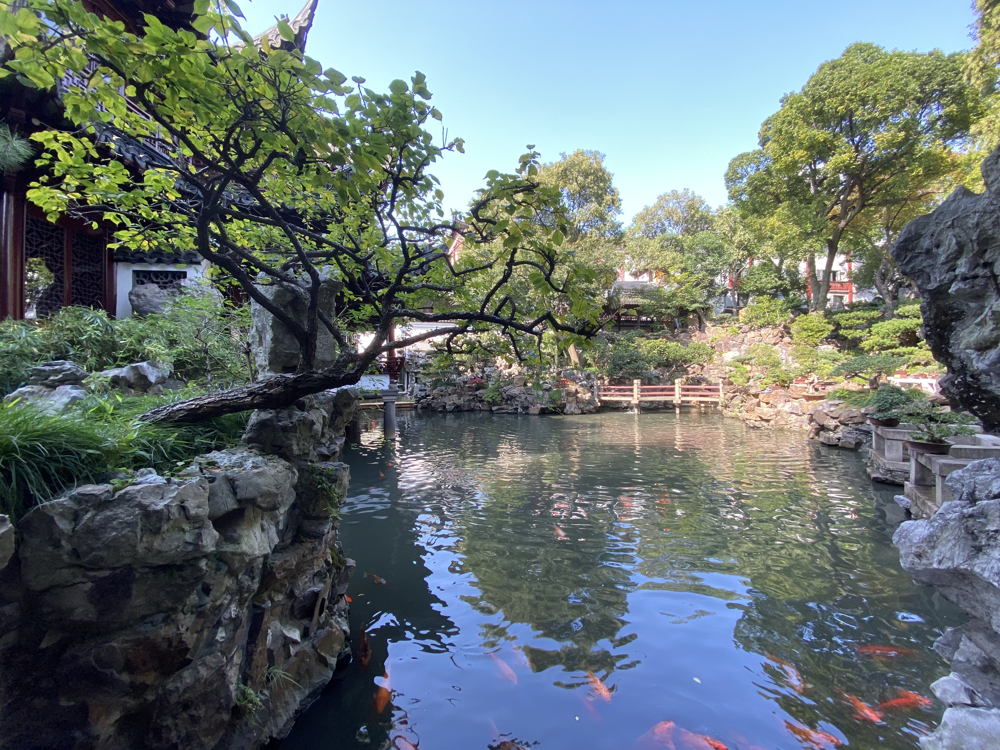
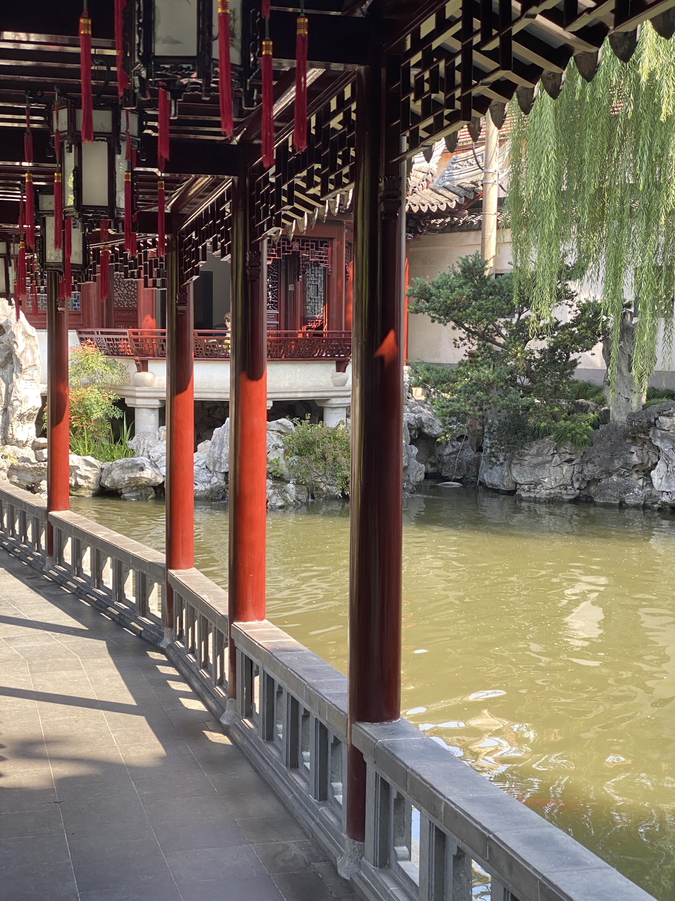
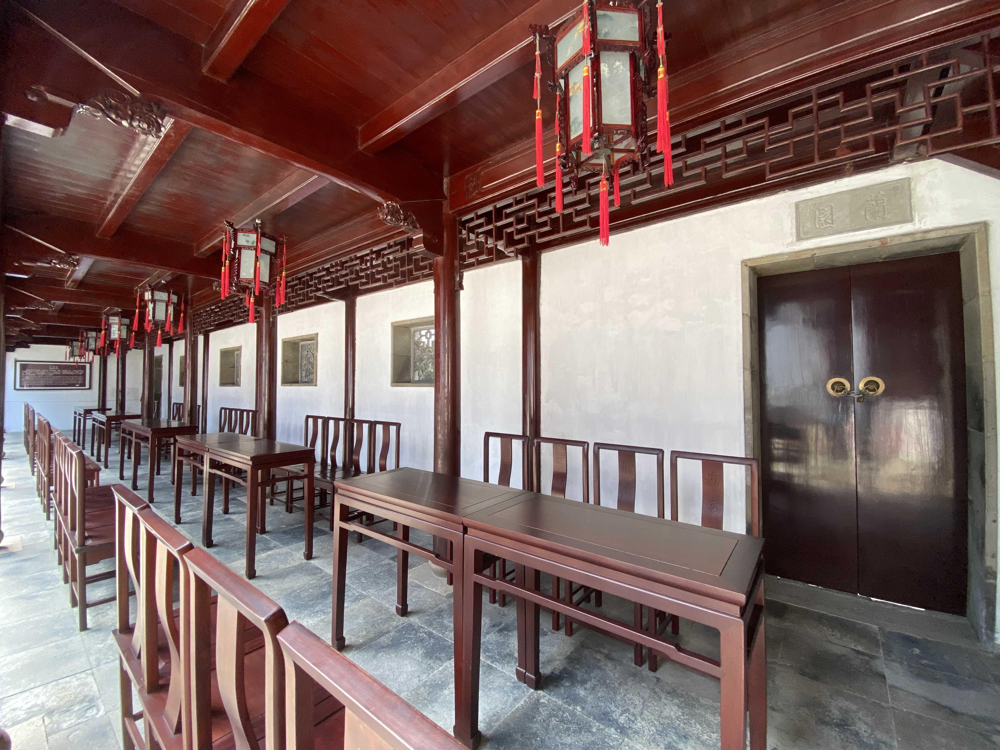
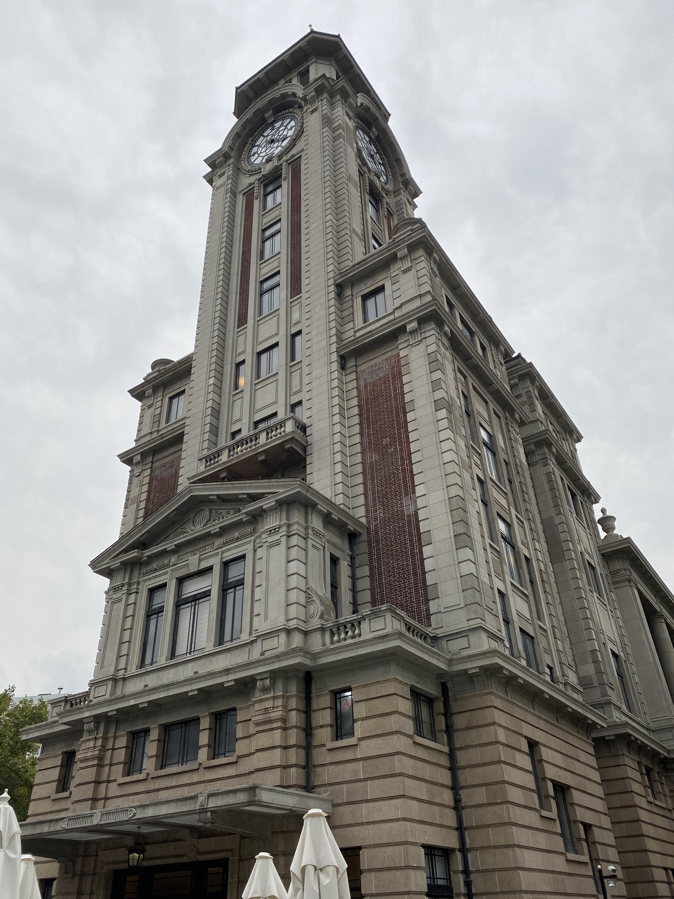
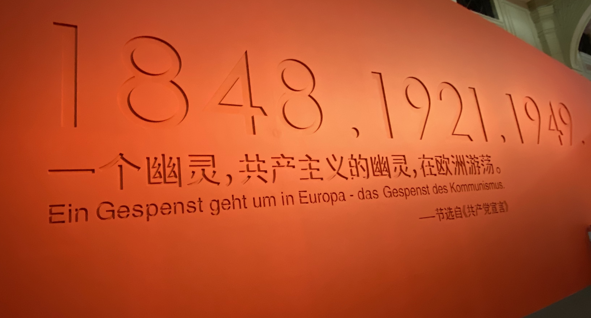
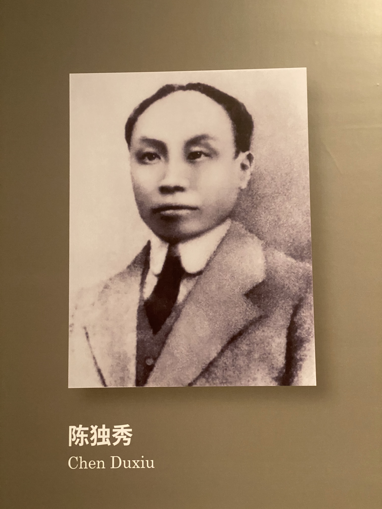
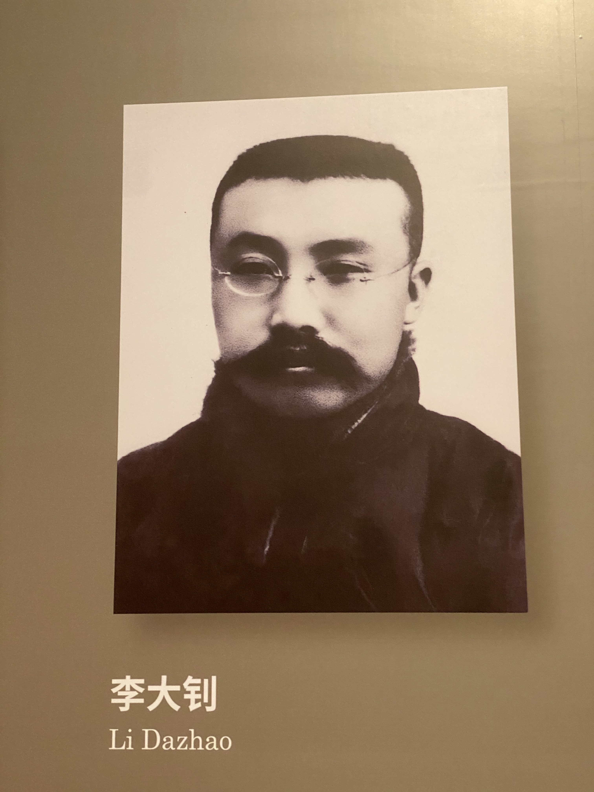

来到杭州已经一个多月了，但是还没有去过杭州的任何地方转过，几乎每个周末都行事情，一开始是买各种东西，然后是安装热水器、洗衣机和网线，再然后就是开始考驾照，终于上周得空就先去上海转了一下。

周六下午从杭州出发，然后周日晚上返回，总共一天多时间，所以只能挑两三个地方转一下，上海外滩是必须要见识一下的，而且要看夜景，所以其他地方基本就是上海外滩附近了，旅行网站的推荐是老城隍庙、南京路步行街、豫园。我自己只有一个人，也没有逛街的习惯，所以南京路步行街先排除了，豫园和老城隍庙可以转一下。另外，上海外滩算市中心了，附近有很多科技馆、博物馆、美术馆可以参观，上海外滩对面就是宇宙中心陆家嘴了，最著名的建筑就是东方明珠电视塔了，另外还有很多高楼大厦，很繁华。

## 行程安排

我自己的大致行程安排是：

* 周六晚上：上海外滩
* 周日上午：豫园和老城隍庙
* 周日下午：人民广场、上海博物馆或者上海自然博物馆

<!-- 这里是地图 -->

## 酒店

订是上海外滩附近的八号艺术酒店，体验不好，首先价格不便宜，然后空间比较小，十几平米，没有桌子摆放的空间，尽管我也不需要。另外，隔音基本没有，隔壁的说话声甚至都能听见。当然这些都是网上评价已经看到了，所以有所心里准备。最最体验不爽的是早餐服务，从打电话叫到送上门花了四五十分钟，而且还是我在门口等着他来了要的。早餐也是非常简单，一盒奶、一个鸡蛋、两个小包子、一碟咸菜，成本不到 5 块钱，这种饭菜和体验还不如不提供呢，反正以后拉黑这家店了。

另外，也别指望从窗户看什么上海外滩夜景了，老老实实去上海外滩吧，其实能欣赏上海外滩夜景的酒店很少，还得合适的房间号，价格会很贵的，不如住得远点，价格还能便宜些。

## 上海外滩

之前已经在网上看过上海外滩的各种照片了，典型的摄影地点，旅行打开地点，人气很旺，记得有一年元旦跨年晚会发生了踩踏事故。办理完入住酒店手续之后，就出发去外滩了，街道很多，比较窄，人也很多，基本都是去外滩的，十字路口有交警维持秩序。这边的建筑物风格都是典型的民国时期风格，因为当时外国租界就在这里，适合拍照。到外滩之后，发现这样平常的周末，人也非常多，观景大道上面基本占满了人。我到一家肯德基随便吃了晚饭，然后就开始我的外滩之行了。黄浦江面不时有各种旅游船只游过，对面的东方明珠等大厦灯光变换，这边人流不断窜动，有人拍照，有人欣赏景色。我先从中间往南走，然后折返回来，向北一直走到上海人民英雄纪念塔，再到外白渡桥，一路也不断拍照，练习我的手机摄影能力。这样从不到八点已经到了快十点钟，然后就开始往回走，往回走由于没有看地图，凭借印象走，结果走错了，中间打算去上海外滩美术馆看下，结果正在维护，只好直接回酒店了。

## 老城隍庙和豫园

这两个地方就是挨着的，老城隍庙有庙，也有各种小吃，豫园是一个典型的古代南方庄园。上午快九点才出发，九点半开始游览，当然老城隍庙没有怎么逛，直接去了豫园。当然，我本人是不大喜欢这种古代大户人家的宅院的，庙也是不太喜欢。不过了解一下古代大户人家的住处也是可以的，看看能精致到什么程度。豫园里面有水、假山、几百年的古树、各种房屋、戏台等，和古装历史剧里面也没差了，里面七拐八拐还是很容易迷路的。

## 上海历史博物馆

本来想去上海博物馆的，无奈因为没票了所以就去了附近的上海历史博物馆，一开始我内心想的是上海除了民国历史还有历史吗，后来发现我错了，和中国古代其他地方一样，很早就有人了，最早是属于良渚文明区的，后来历经吴越楚，秦汉等所有朝代都设有管辖，只不过名称不是上海，那时也不繁华。

上海历史博物馆主要参观区域有四层：第一层是红色革命历史；第二层是古代上海；第三和第四层是近代上海，主要就是清末民国建国时期。有各种照片、书刊、文物、历史纪念物等，也有很多投影仪讲解。

在第一层时遇到一个可能不到十岁的少年郎，传着红军的军装，然后给别人讲解每个照片的，印象最深的就是声音：很嘹亮，很正能量，很正式的用很标准的普通话在念。

第二层有两个使用了高科技的展示，一个是裸眼 3D或者说 AR 技术，另一个是听觉方面的，音箱就在头上面的屋顶，但是感觉声音就在耳边，四周也没发现其他音箱，这两个真想不通怎么做到的。

## 上海路名

上海的路名是以各省市乃至县名来命名的，其历史也伴随着中国近代历史，从民国开始推广的，不过是伪政权汪精卫推广的，后来新中国成立后保留了大部分以省市命名的道路，再然后因为名字不够用了就开始用县的名称了。

## 总结

因为行程时间有限，所以只是简单看下上面的几个景点，还有陆家嘴、东方明珠、武康路历史文化名街、上海迪斯尼、杜莎夫人蜡像馆、美术馆等留着下次去上海参观吧。