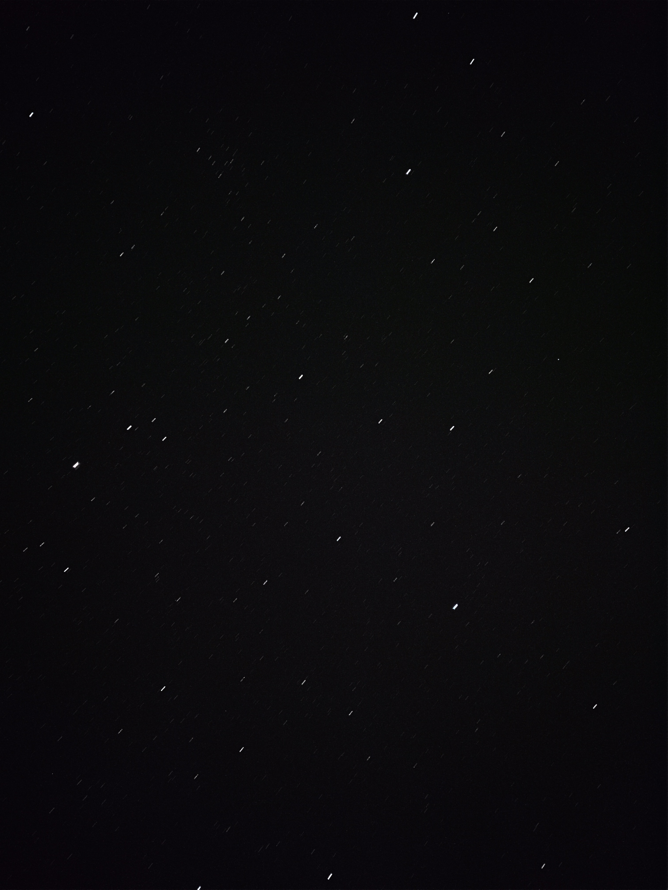

5月1日到5月9日和朋友一起四个人合租一辆 SUV 从乌鲁木齐出发，先经过一路颠簸的 S101，然后一路向西直到赛里木湖，再绕向南方，经伊宁、昭苏到达夏塔。然后，折返一路向东，经过喀拉峻、那拉提，向东北返回乌鲁木齐，最后去天池逛一下，整个行程结束。

## 行程

### 第一天 5.1

两位从北京出发，我和另一位从杭州出发，晚上先后到达乌鲁木齐地窝堡机场附近的酒店。这个时候虽然是晚上，但是因为时区，乌鲁木齐到九十点才会天黑。

### 第二天 5.2

早上饭后到酒店附近神州租车服务点取车，带上所有行李，大概十点多钟出发，往 S101 入口方向走，然后整个下午以时速 20 公里的高速，一路颠簸前行。后来遇到乡道就早点出来，向北经过呼图壁上了连霍高速，晚上八点左右到达奎屯市。进奎屯市的时候要现场做核酸检测，排队花了几十分钟。

### 第三天 5.3

从奎屯市出发沿着连霍高速走大概 300 公里下午两点左右到达赛里木湖，然后开着车绕湖慢慢开，有部分湖面还在结冰，五点半离开。然后向西南，再东南到达伊宁市。

### 第四天 5.4

因为直接往南到昭苏的路在修理，所以往东绕了很大一个圈子，中午两点多到昭苏吃了午饭，给车胎充了气。然后四点半左右到达夏塔，因为夏塔到七点前必须出来，又比较大，所以时间比较紧张。从夏塔返回之后，找了找昭苏的路途中的一家店住宿，店远离生活区，因为有人要半夜拍银河。

### 第五天 5.5

中午过后到达喀拉峻，午饭就吃的乌鲁木齐买的自嗨锅，大概逛了三个小时，然后就出发往那拉提附近的新源，九点左右到达新源。

### 第六天 5.6

整个一天都在那拉提，那拉提有三个路线，一天时间只够逛两个，晚上的时候就在那拉提出门附近的酒店住宿。

### 第七天 5.7

整个一天都在返回乌鲁木齐的路上，中间遭遇了车祸导致的大堵车，一直到晚上十一点多才到住处。

### 第八天 5.8

只有天池，时间很充裕，甚至下午几个人用手机开始了斗地主，因为天气原因天池景色看起来比较普通，所以早早结束了。

### 第九天 5.9

返回杭州。

## 景点

### S101 公路

S101 公路两侧主要是岩石、峡谷风景，地处地震断裂带，所以两侧小山岩石颜色不同，也会出现层叠效果，尤其是刚进入 S101 的一段路程。不过，刚开始的路尤其不好，都是亢亢洼洼，不适合小轿车行走。

### 赛里木湖

赛里木湖海拔 2071 米，双向双车道公路绕湖一圈，路线就是从空中看，逆时针方向。边走边停，可以看一下午，此时湖面还有很多结冰，因为四面基本都是山，阳光照射少的地方整个湖面处于结冰状态。

### 夏塔自然景区

夏塔位于雪山脚下，还没有到的路上就远远看到雪山了，到夏塔风景入口还需要乘坐景区游览车才能到最里面的景区，大概有一二十公里，因为海拔高，这个时候气温也低，所以草还不是一片绿。

### 喀拉峻大草原

乘坐景区大巴游览，这个时候真得不合适，草还是青黄色的，并没有用手机拍照。

### 那拉提大草原

那拉提有三条路线：空中草原、河谷草原、盘龙谷。可以开自己车进去游览，一天时间最多逛两条，我们选择的是空中草原和河谷草原。不过遇到了一个小插曲，刚进去半个小时发现油快没了，进入之前忘记加油了，因为里面有爬山路所以比较费油，担心油不够，就找到一个不是入口的地方出来又进去了，当然，出来时提前和查岗的说明了情况。

### 天池

离乌鲁木齐不远，被山包围的湖，算是典型的近郊游景点，需要乘坐景区大巴进去，刚开始会把你送到一个购物吃饭的地方，然后再到真正的景区。可能是因为离市区比较近，玩的人还比较多，里面有寺庙，有游船。

## 自嗨锅、卡瓦斯和奶啤

之前都没有听说过的东西。自嗨锅是一种自家热的食品，非常适合旅行，通过化学反应加热，种类也有很多米饭、面食、火锅等。卡瓦斯含有低度酒精，比啤酒还低，有甜味，有啤酒一样的泡沫，夏天喝很爽。奶啤，听名字就像牛奶和啤酒的混合，味道嘛，确实像优酸乳酸奶兑啤酒。

## 自驾游？

因为自己刚刚拿到驾照，所以都是朋友在开车，还不是真正的自驾游。不过自己最近在市区练过几次车之后，发现眼部太累了，因为本来就有视觉疲劳，连续开车两个小时就感觉眼部酸痛，跟着大脑也有点儿不舒服。可能是因为在市区需要注意的地方太多，自己又是新手需要格外注意，太费眼了。

路上遇到过两次比较危险的状况：

* **泥泞路会车**：对向的车在泥泞路上相遇了，因为路太窄，在避让车辆时向外打方向盘不管用了，车胎打滑，还好车速比较慢，及时刹车了。
* **借道超车**：当时车况是前面几辆大卡车，后面也是大卡车，然后前面的大卡车要超更前面的，我们跟着超了，结果前面大开车顺利完成超车回到自己的车道了，我们才发现对向车来了一辆大卡车，我们此时已经来不及完成超车了，想要并回自己的车道，发现后面的大卡车已经上来了。然后我们和对向的大卡车赶紧刹车，幸好车速不是很快，否则就更危险了。

泥泞路最好提前避让，借道超车时跟随大卡车还是比较危险的，因为挡住了视线，来不及发现对向车况。

## 航拍

这次又又又证明了，自己是真不会航拍，本来就很少拍，又不去看和学别人的航拍视频，自然拍的时候不知道拍什么，不知道怎么运镜，也不知道怎么拍剪辑出来更好看。比如最近看了 B 站一个比较普通的 UP 主的航拍视频，不能说多美，但是也学到了一些东西：多拍一些短时长的镜头，公路也是可以多拍的，拉高一点儿。

## 手机拍银河？

朋友用单反半夜拍银河，我也跟着凑热闹，用手机 iPhone 11 Pro 拍，经过各种尝试发现拍不了。拍银河必须长曝光，找到了两个可以长曝光的软件：

* **ProCam**：虽然有长曝光功能，但是会添加后期处理，最后拍出来的是一片黑或者只有几个很大的亮点。
* **NightCap**：没有试过拍摄银河，不过尝试了长曝光拍摄星星和星轨，结果也是比较勉强，效果如下（点击查看）。

## 总结

五一到伊犁河谷还是有点儿早，因为海拔比较高，湖的冰没有完全化掉，草也刚刚发芽，杏花也落了，如果一个月之后应该就不错了，但是又没有长的假期。